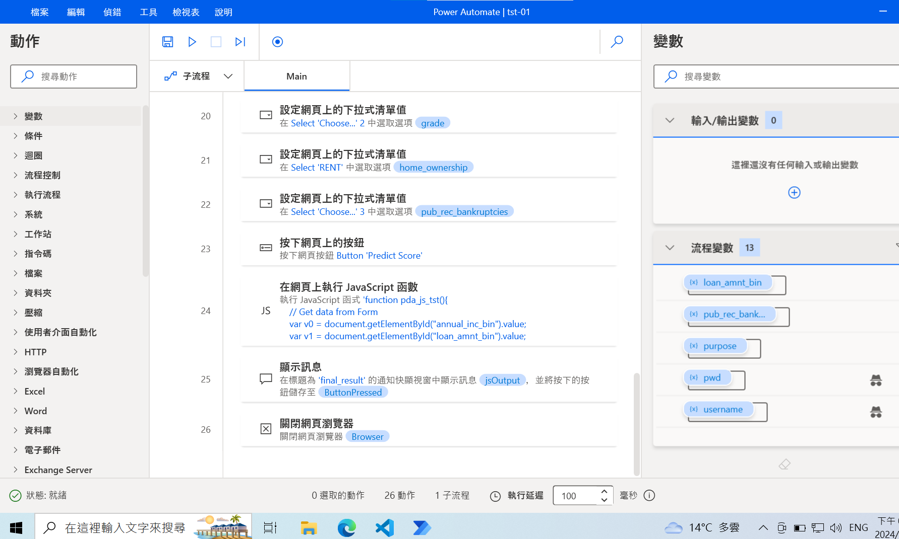
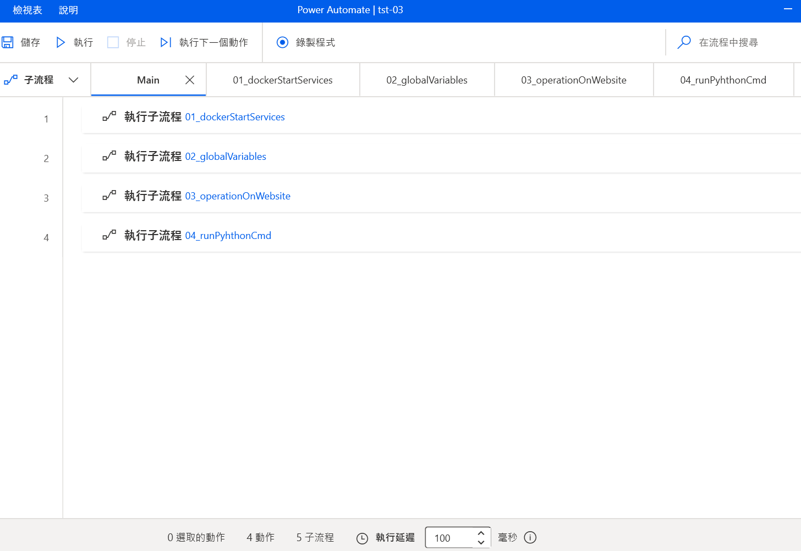
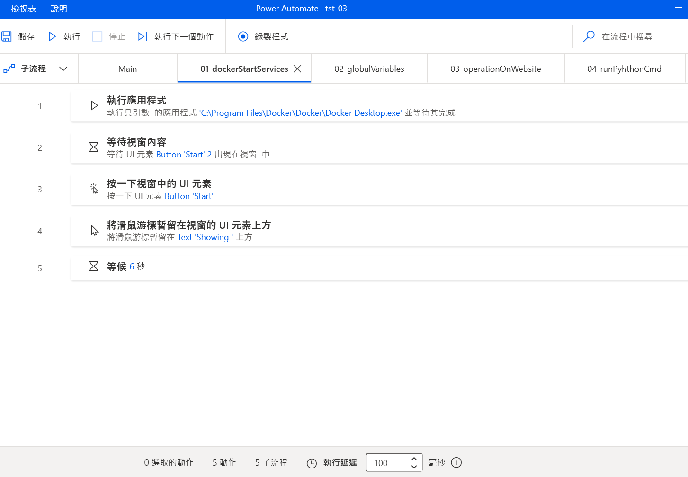
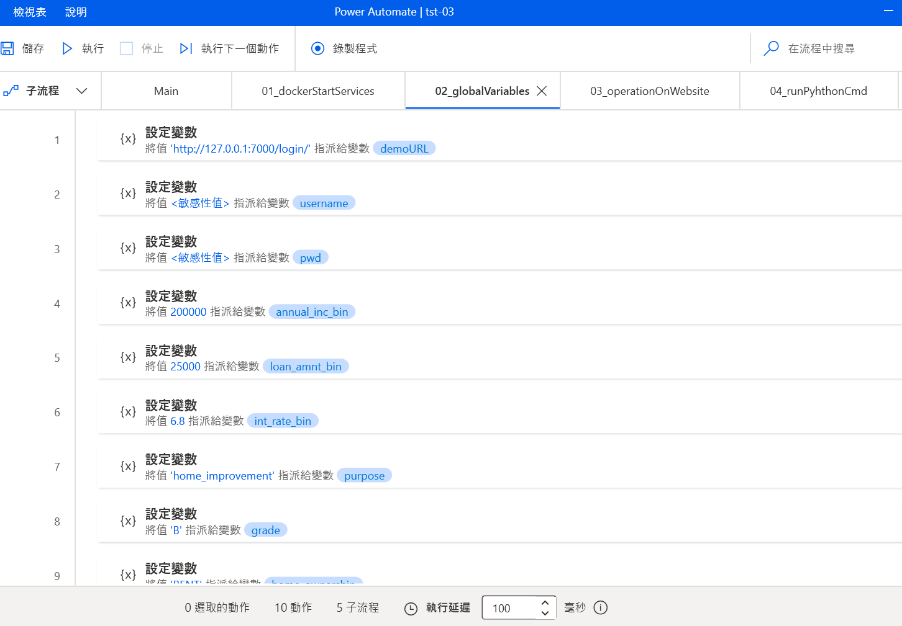
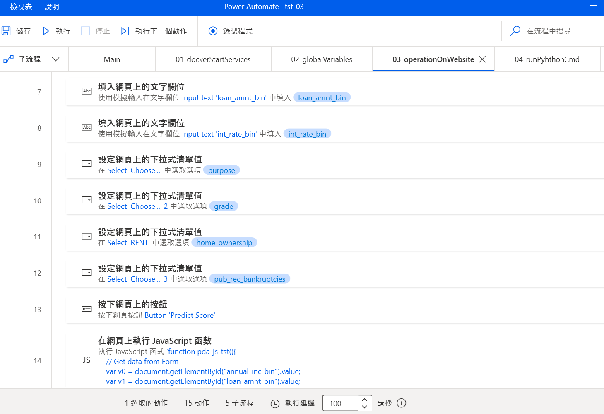
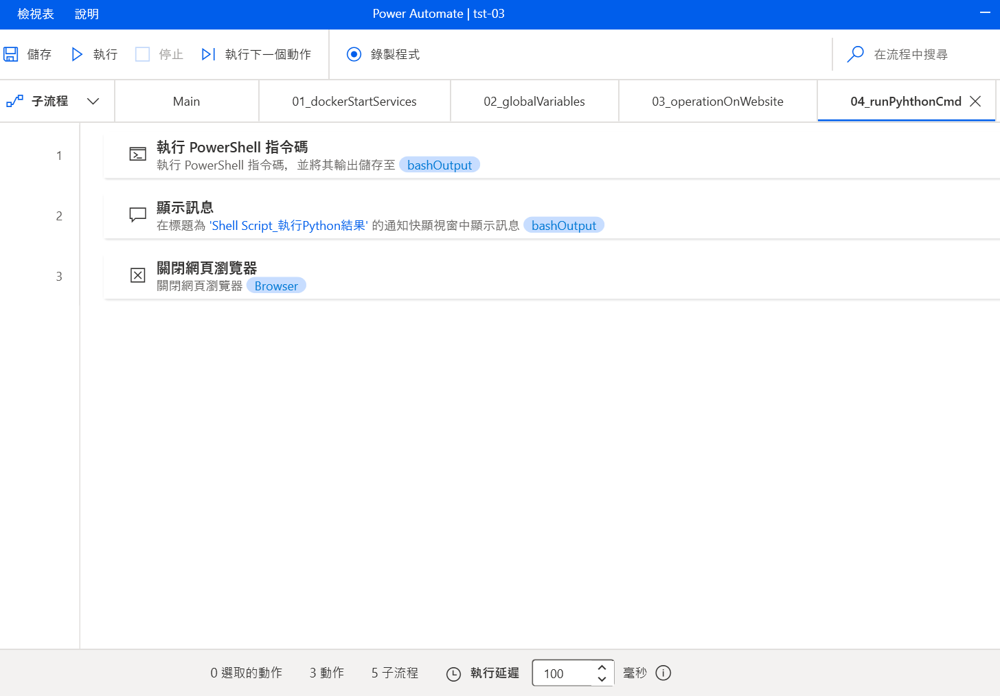
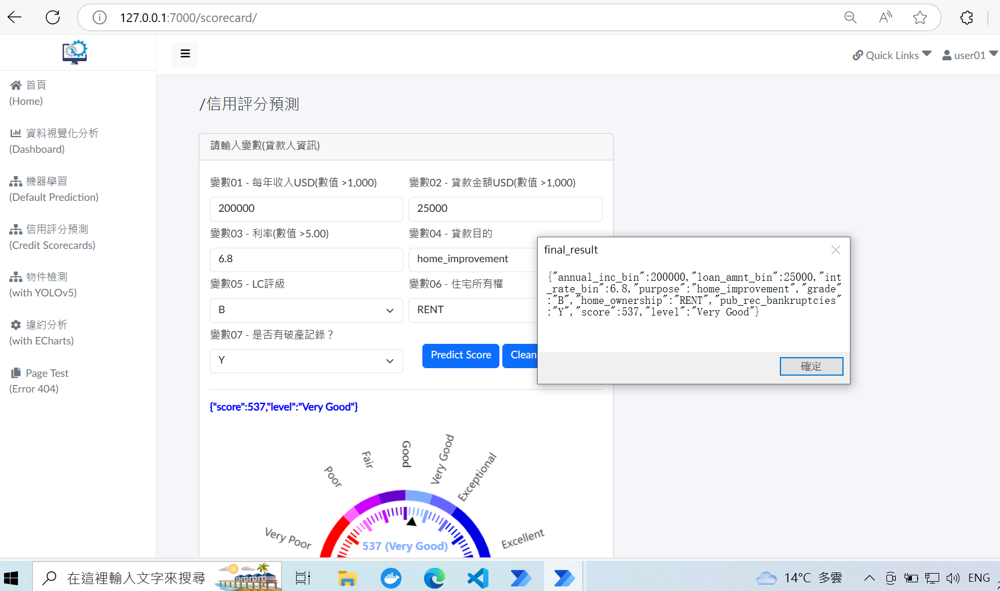

# **power_automate_demo_01**

## **RPA: Displaying an example of integrating JavaScript and Python with Power Automate for Web Automation**

### **Ⅰ. 目的** 
研調 機器人流程自動化 (Robotic Process Automation, RPA)，實作Power Automate來操作「應用程式」及「網頁」，並在其流程中使用JavaScript擷取內容再由Python處理資料。  

### **Ⅱ. 主要工具**
Power Automate Desktop、JavaScript、Python  

### **Ⅲ. 說明**

__1.流程架構__ 

在Power Automate Desktop新增一個「流程」，建立5個「子流程」，並在其中產生各項「動作」，如下圖所示。 

  

__2.各子流程功用__ 

● 子流程「Main」 
為整個流程的執行步驟，即其他4個子流程依序執行。 

  

● 子流程「01_dockerStartServices」 
開啟應用程式「Docker Desktop」，啟動相關服務，如：前端網頁、後端API及資料庫…等( 詳見 [專案django_demo_01](<https://github.com/qinglian1105>) )。 

  

● 子流程「02_globalVariables」 
為設定所需變數，主要為輸入網頁之資料。 

  

● 子流程「03_operationOnWebsite」 
操作瀏覽器到目標網頁後，填寫Form送出，返回預測結果，由JavaScript程式 (詳見 demo_pad_tst_01.js )擷取輸入資料及預測結果。  

  

● 子流程「04_runPythonCmd」 
使用「動作」的「執行 PowerShell 指令碼」來執行Python程式 (詳見 demo_pad_tst_01.py)，將JavaScript程式執行結果作編輯，給予「顯示訊息」呈現，並儲存成CSV檔 (詳見 predict_report.csv)，最後關閉瀏覽器。 

  

__3.執行結果 - 最後顯示訊息畫面__ 

Power Automate開啟瀏覽器(Microsoft Edge)，到網站( 127.0.0.1:7000/login，如上述 [專案django_demo_01](<https://github.com/qinglian1105>) ) ，接著輸入帳密登入進入首頁後，於左側side menu點選「信用評分預測(Credit Scorecards)」選單，即進入目標頁面，填完Form的 7 個變數資料，點擊按鍵「Predict Score」後，將於下方以藍色文字及儀表盤呈現預測結果(分數、評級)，由JavaScript程式擷取輸入資料及預測結果，再由Python程式編輯及寫入CSV檔，返回予「顯示訊息」呈現，按下「確定」後關閉網頁，以完成整個流程自動化過程。 

  

__以上，一個Web Automation的例子展現Power Automate、JavaScript、Python整合。__
   

---

### **References**

[1] [RPA教室](<https://www.youtube.com/@RPA-Class>)

[2] [Gartner 魔力象限報告 2024 RPA 市場現況與主要供應商分析](<https://aiworks.tw/gartner-magic-quadrant-2024/>)

[3] [Microsoft Power Automate – 程序自動化平台](<https://www.microsoft.com/zh-tw/power-platform/products/power-automate>)

