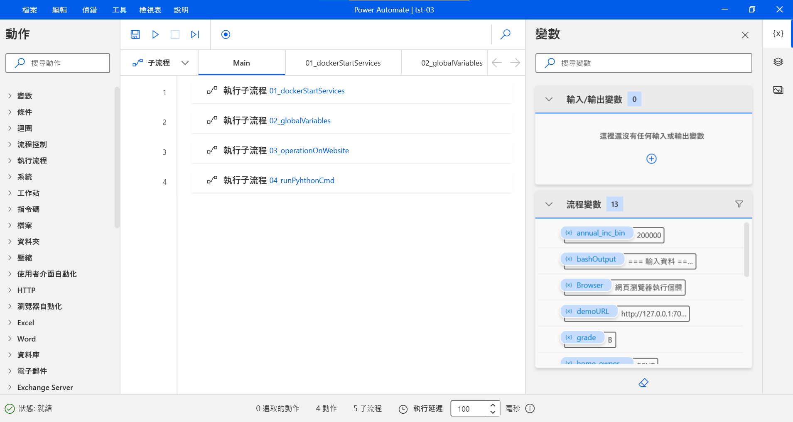
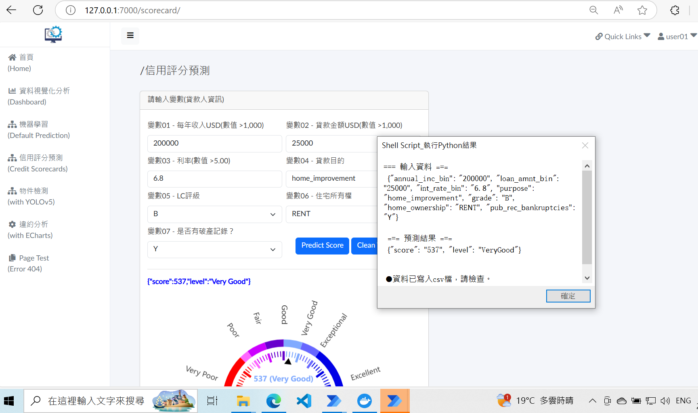

# **power_automate_demo_01**

## **RPA: a simple example of integrating JavaScript with Power Automate for Web Automation**

#### **Ⅰ. 目的** 
研調 RPA (Robotic Process Automation)，實作Power Automate Desktop來操作網頁，並在其流程中使用JavaScript擷取內容。 

#### **Ⅱ. 主要工具**
Power Automate Desktop、JavaScript

#### **Ⅲ. 說明**

● 流程內容： 
在Power Automate Desktop開啓一個「流程」，建立各項「動作」。 
首先，開啟瀏覽器(Microsoft Edge)，到一個網站( 專案django_demo_01 [詳見](<https://github.com/qinglian1105>)) ，接著輸入帳密登入，於左側side menu點選某一選單，在Form填入資料按鍵執行，由執行JavaScript程式擷取輸入資料及預測結果，返回給「顯示訊息」顯示，最後按「確定」後關閉網頁。  

● 頁面展示： 
【 Power Automate Desktop - 流程頁面 】 
流程由26個「動作」組成，主要有設定變數、瀏覽器自動化項目、JavaScript函數、顯示訊息…等，如下圖所示。 
  
【 流程執行頁面 - 最後顯示訊息 】 
Power Automate執行至此頁面時(選單-信用評分預測)，填完Form的 7 個變數資料，按「Predict Score」鍵後，將於下方以藍色文字及儀表盤呈現結果(分數、評級)，Power Automate安排 執行JavaScript函數(詳見程式檔 demo_pda_tst_01.js)擷取輸入資料及藍色文字存成變數，再返回予「顯示訊息」顯示內容如下圖所示，按「確定」後關閉網頁以完成整個Process自動化過程。 
 
以上，一個簡單Web Automation例子展現Power Automate與JavaScriptn整合。  

---

#### **References**

[1] [RPA教室](<https://www.youtube.com/@RPA-Class>)

[2] [Gartner 魔力象限報告 2024 RPA 市場現況與主要供應商分析](<https://aiworks.tw/gartner-magic-quadrant-2024/>)

[3] [Microsoft Power Automate – 程序自動化平台](<https://www.microsoft.com/zh-tw/power-platform/products/power-automate>)

